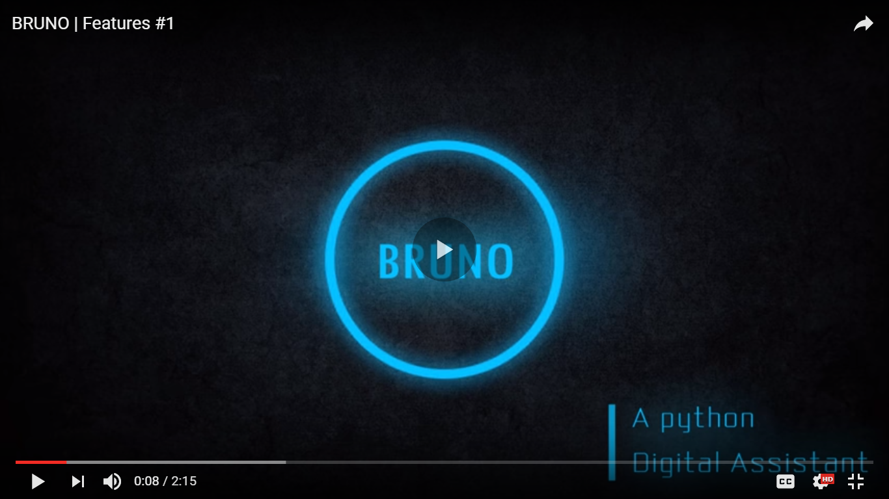

# Digital-Assistants

## Automating the daily stuffs

## View the demo here

## Installation

### daily.py

### Requirements

  - Windows
  - Microsoft sapi 5
 
1. Install the modules
   wxpython, speechrecognition, wolframalpha, wikipedia, requests, pyaudio.
2. Get NEW SCIENTIST API from here : [New Scientist](https://newsapi.org/new-scientist-api)
3. Get TIMES OF INDIA API from here : [Times of India](https://newsapi.org/the-times-of-india-api)
4. Get the WOLFRAM API from here : [Wolfram](https://developer.wolframalpha.com/portal/signup.html)
5. Place the APIs at the right postition and run the program.

## Features present and accessing them:
1. Google search
   - Say anything like 'search xyz'.
2. Play song on Youtube
   - Say anything like 'play xyz'
3. Open any webpage
   - Say anything like 'open xyz'
4. Empty recycle bin
   - Say 'empty the bin' or 'empty recycle bin'
5. New Scientist News
   - say 'science news'
6. Times of India news
   - say 'headlines please'
7. Locking the device
   - say 'lock the device'
8. Playing the offline videos
   - First you need to create a folder named Videos where your daily.py is present
     then place the videos and change the name in the code.
     To access it say anything that ends with 'bored' like 'i'm getting bored'.
 
## Note
   Most of the features won't work on Ubuntu
